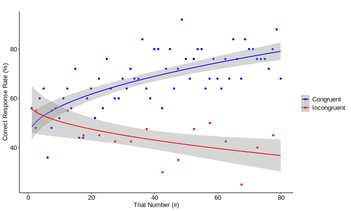
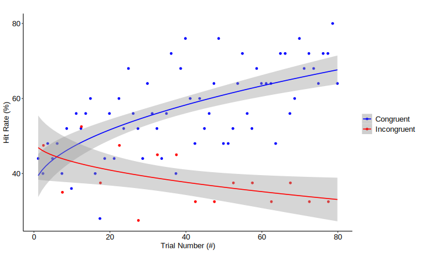
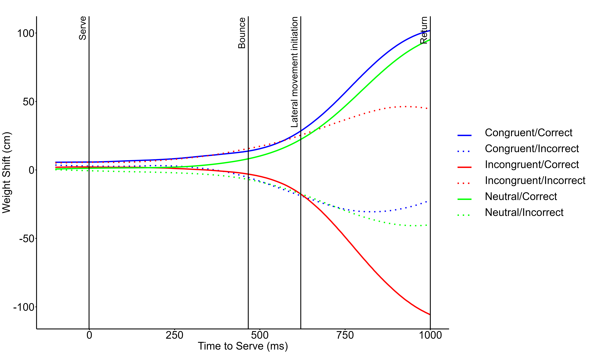

This is the repository for our work “*Exploiting prior knowledge in continuous decision-making under uncertainty: the case of tennis experts*” containing data and code used for the data analysis as well as the experimental protocols. Further, you will find c3d files of a 21 skeleton model of each return of each tennis player and the visualisation tool Mokka on Zenodo (https://doi.org/10.5281/zenodo.15915772).

We developed an immersive XR tennis environment, where we tested how tennis players exploit prior knowledge to improve performance und continuous decision-making when returning tennis serves.

[Watch the full video on Zenodo](https://doi.org/10.5281/zenodo.15915772)

## Experimental design
Players’ task was to return tennis serves. In the experiment, we manipulated the distributions of the opponent’s preferred serve locations (80% to the right vs. 20% to the left of the service box and vice versa in a second session). This design creates trials that either match players’ expectations (congruent, 80%) or violate them (incongruent, 20%).

**Measures:**
- Correct response rate (% of trials where movements are initiated in the correct direction)
- Hit rate (% of trials where the ball is hit)
- Weight shift dynamics over the split step (based on full-body motion capture)

## Effect of accumulating prior knowledge on performance
Figure 1 shows the development of players’ performance over the experiment, in terms of correct response rate (left) and hit rate (right) in congruent (blue) and incongruent trials (red). Data shows that players increasingly rely on accumulated prior knowledge resulting in performance increases in congruent (frequent, 80%) trials, while accepting the costs of performance decreases in incongruent (infrequent, 20%) trials. This strategy increases overall performance over the experiment.

<table style="table-layout: fixed; width: 100%;">
  <tr>
    <th style="width: 50%;">Correct response rate</th>
    <th style="width: 50%;">Hit rate</th>
  </tr>
  <tr>
    <td style="text-align: center;">
      
    </td>
    <td style="text-align: center;">
      
    </td>
  </tr>
</table>

## Weight-shift dynamics over the split step 

Figure 2 shows how players’ weight shifts evolve over the return movement. Data are separated for congruent (blue), incongruent (red) and neutral (green) trials as well as for correct (solid lines) and incorrect (dotted lines). The weight-shift data are plotted relative to the prior; that is, positive values reflect a behavior in which the opponent’s preferred serve direction is taken into account. For comparison, Figure 2 also includes the weight-shift data for the neutral condition (green lines), in this case (as no prior direction exists) plotted relative to the correct movement direction.
Data indicates that participants continuously adjust their weight shift over the split step with incoming sensory information, while a bias toward the expected direction can be observed already before the serve.

## Repository structure 

A video of the experimental task is available on [Zenodo](https://zenodo.org/records/15915772) or an excerpt in the folder [experimental_task](./experimental_task). 
The folders [c3d_files](https://zenodo.org/records/15915772) contain c3d files (for all trials and all players) with a 21 point full body model and the Mokka software to visualise the c3d files; 6160 files in total.
The R script to run the analysis is in the folder [code](./code). 
All data used for the analysis is stored in a csv file in the folder [data](./data). The data file all_data is structured as follows:
| Column name                             | Description  |
|------------------------------------------|-------|
| vp                                       |  player     |
| trial                                    |    trial number   |
| condition                                |   warm up/neutral/congruent/incongruent    |
| side_played                              |    left/right   |
| correct_response                         |   1 = true, 0 = false    |
| hit_true_false                           |    1 = true, 0 = false   |
| serve_time                               |   time in relation to the serve    |
| bounce_time                              |   time in relation to the serve    |
| hit_time                                 |   time in relation to the serve    |
| splitstep_performed_com_5cm_below_max     |   1 = true, 0 = false    |
| splitstep_start                          |   time in relation to the serve    |
| lateral_movement_initiation               |   time in relation to the serve    |
| side_tendency_minus_200                  |   weight shift (positive means to the left)    |
| side_tendency_minus_195                  |   weight shift (positive means to the left)    |
| side_tendency_minus_190                  |   weight shift (positive means to the left)    |
| .                  |   .    |
| .                  |   .    |
| .                  |   .    |
| side_tendency_minus_005                  |   weight shift (positive means to the left)    |
| side_tendency_000                        |   weight shift (positive means to the left)    |
| side_tendency_005                        |   weight shift (positive means to the left)    |
| .                        |   .    |
| .                        |   .    |
| .                        |   .    |
| side_tendency_990                        |    weight shift (positive means to the left)   |
| side_tendency_995                        |    weight shift (positive means to the left)   |
| side_tendency_100                        |   weight shift (positive means to the left)    |

All plots are in the folder [plots](./plots).
There is an R studio project to reproduce all statistical analyses and plots.
Each individual experimental protocol can be found in [experimental_protocols](./experimental_protocols). The experimental_protocols come in separate spread sheet files (in xlsx format), which are structured as follows:

|       Column name       | Description                        |
|--------------|--------------------------|
| session      | name of the session       |
| block        | block ID                  |
| trial        | trial number              |
| left_right   | side played (left/right)  |

